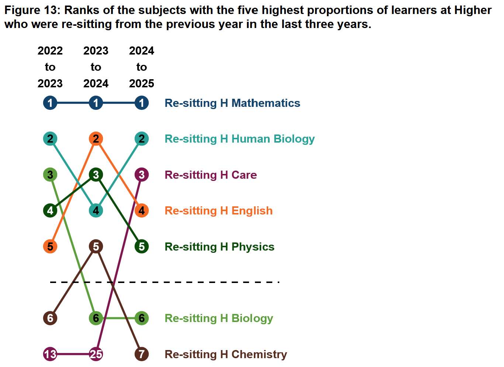
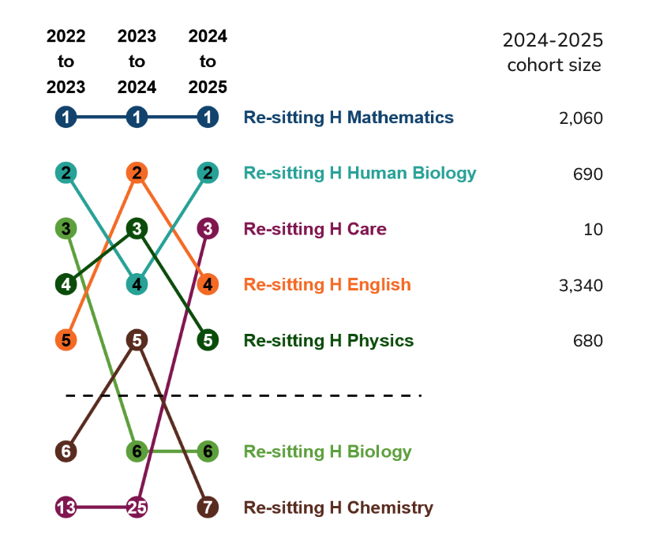
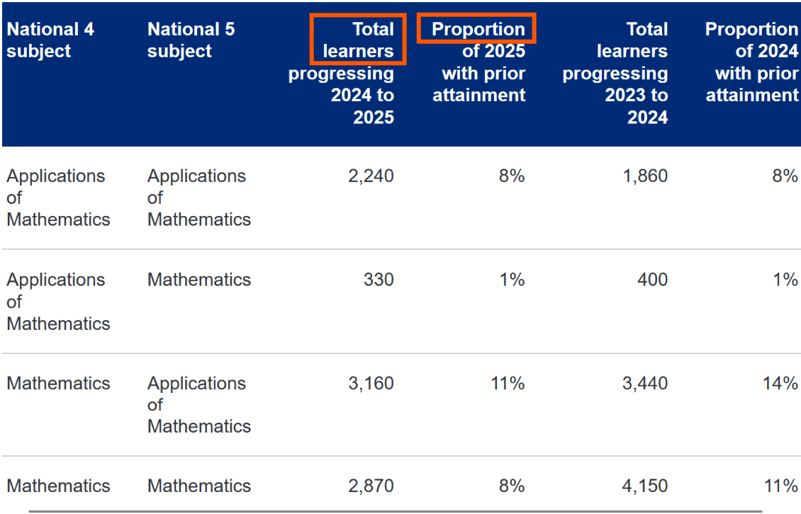
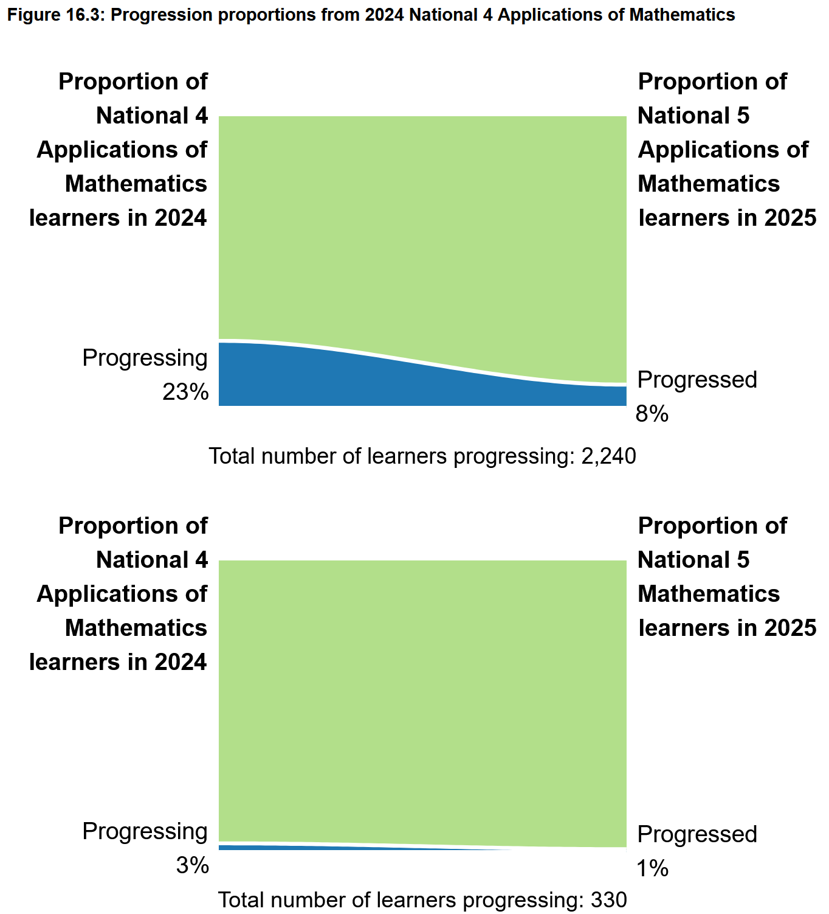
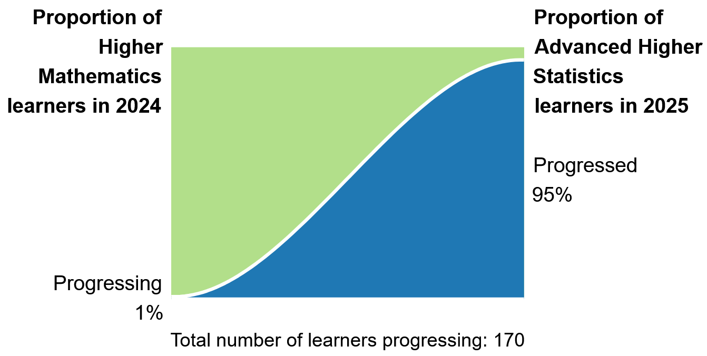
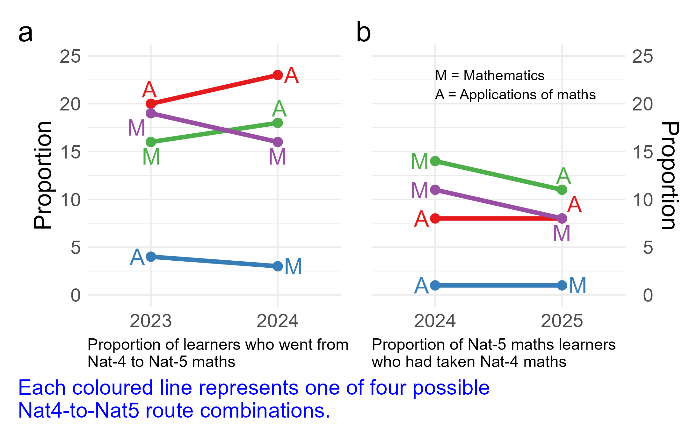

## Overview 

::: {.notes}
Learner progression through Scotland's National Qualifications framework.
:::

:::{.callout-tip icon='false'}
### The Publication

Progression Statistics 2025 - Official Statistics in Development

Tracks learner movement across National Qualifications:

- N4 -> N5
- N5 -> Higher  
- Higher -> Advanced Higher
- Re-sits at N5 and Higher
:::

:::{.callout-tip icon='false'}
### This Review

Focuses on the __figues__ and __tables__ on the published page

Two elements worthy of __positive recognition__

Two areas where __further development__ could be made
:::

## Summary

:::{.notes}
- start with the end
- move on quickly
:::

| | |
|---|----------------|
|  __Star 1__ | Subject ranking figures - information-rich; readable; tell a story for several subjects |
|  __Star 2__ | Dual progression perspective - looks both forwards and backwards; avoids misleading conclusions |
|| |
|  __Wish 1__ | Cohort proportion figures - curved lines mislead; a parallel approach reveals hidden patterns |
|  __Wish 2__ | Page structure - figures buried; audience and purpose could be clearer |

##  Star 1: The Subject Ranking Figures {background-color='#1C3A5E'}

::: {.notes}
The key message here is that the ranking figures are great
- information rich but readable
- Tell a story over time for top ranked plots
:::

##  Star 1: The Subject Ranking Figures

##  Star 1: The Subject Ranking Figures

::: {.notes}
Figure 13 (re-sitting Higher)
- specific example
- Note that these figures appear to be exported from the interactive Shiny app, which means users of the app see the same quality of visualisation
- a good sign for consistency between the page and the tool
:::

:::{.columns}
:::{.column}
<!-- col 1 content -->

:::

:::{.column}
<!-- col 2 content -->

:::{.callout-tip icon='false'}
Each figure shows __simultaneously__:

- Which subjects have the highest counts or proportions
- How those rankings have __changed year on year__
- Relative stability or changeability of subject position

> Why not a table..?
:::

:::{.callout-tip icon='false'}
__What makes them work:__

- Consistent colour palette across figures
- Rank position labelled directly on the figure
- Three years shown, enabling trend reading
- Compact - high information density per unit of space
:::

:::
:::

##  Star 1: The Subject Ranking Figures

##  Star 2: The Dual Perspective on Progression {background-color='#1C3A5E'}

##  Star 2: The Dual Perspective on Progression

::: {.notes}
Presenting both directions of the same measure is a nice methodological choice
:::

##  Star 2: The Dual Perspective on Progression

::: {.notes}
For N5 to Higher English 64% of N5 English learners progressed to Higher English (proportion progressing)

While 85% of Higher English learners came from N5 English (proportion with prior attainment).

- First tells us about how many move up
- Second tells us that Higher English is almost entirely made up of 'conventional route'.
- They compliment - neither gives the full picture on its own
:::

:::{.columns}
:::{.column width=35%}
<!-- col 1 content -->

:::
:::{.column width=65%}
<!-- col 2 content -->

Two complementary measures presented together for each transition:

:::{.callout-tip icon='false'}
### Proportion Progressing

_Of all N4 learners, how many moved to N5?_

Describes __behaviour and choices__ of the originating cohort

-> Useful for understanding entry decisions and pathways
:::

:::{.callout-tip icon='false'}
### Proportion with Prior Attainment

_Of all N5 learners, how many came from N4?_

Describes the __composition__ of the receiving cohort

-> Useful for understanding where learners come from
:::

:::{.callout-tip icon='false'}
__These answer different questions.__

A subject could have a low progression rate _and_ a high prior attainment proportion - and both facts would be important.
Giving both avoids misleading conclusions that either measure alone might suggest.
:::
:::
:::

## Wish 1: The Cohort Proportion Figures {background-color='#4A1942'}

::: 

:::

## Wish 1: The Cohort Proportion Figures

:::{.columns}
:::{.column}
<!-- col 1 content -->

:::
:::{.column}
<!-- col 2 content -->

:::
:::

## Wish 1: The Cohort Proportion Figures

::: {.notes}
Because there are only two time points, the curved line between them implies interpolated data that does not exist.

This is a data integrity issue, not just a stylistic one.
:::

__What the current figures do:__

Each cohort proportion figure shows a curved area chart transitioning between two data points - one for each year

__Two problems with this approach:__

:::{.callout-tip icon='false'}
### Information poor

Each figure uses considerable space to convey __only two numbers__

Multiple separate figures prevent cross-subject comparison, which is often exactly what a reader wants to do
:::

:::{.callout-tip icon='false' }
### The curve is misleading

A smooth curve between two discrete annual measurements implies a __continuous trend__ that does not exist

There is no data between 2024 and 2025 - the curve is an artefact of the chart type, not a feature of the data
:::

##  Wish 1: A Better Alternative

::: {.notes}
__Left panel:__ proportion of N4 learners who moved up to N5 - increasing over time for most routes.

__Right panel:__ proportion of N5 learners who came from N4 - decreasing.

These are moving in opposite directions simultaneously, which is invisible in the QS's own figures.

This kind of parallel coordinates approach enables comparison across routes and surfaces patterns that the current design hides.

Note the x-axis now uses session labels (2023-24, 2024-25) which is more precise than single-year labels.
:::

An alternative approach - plotting all progression routes together on shared axes:

{width='85%'}

##  Wish 1: What This Reveals

::: {.notes}
The current design conceals a meaningful pattern in the data.
:::

:::{.columns}
:::{.column width=65%}
<!-- col 2 content -->

:::{.callout-tip icon='false'}
Plotting both measures together on shared axes reveals a pattern __invisible in the current page:__

- The __proportion of N4 learners progressing to N5 increased__
- The __proportion of N5 learners who came from N4 decreased__

These move in opposite directions simultaneously

This means N5 cohorts are __growing faster__ than the N4 progression pipeline - most N5 learners are arriving by routes the page does not capture
:::

:::{.callout-tip icon='false'}
### Why this matters

This is not a visualisation preference - it is a __substantive finding__ about learner pathways that the current design makes structurally difficult to see
:::

:::
:::{.column width=35%}
<!-- col 1 content -->

{width='85%'}
:::
:::

##  Wish 2: Page Structure and Audience {background-color='#4A1942'}

::: {.notes}
- User experience and communication
- the page buries its most accessible content and does not clearly serve any one audience.
:::

##  Wish 2: Page Structure and Audience

__The current structure:__

Tables are the __default view__ - figures are hidden in accordions

:::{.callout-tip icon='false'}
### The problem
- Figures are the most accessible entry point for a non-specialist reader
- Hiding them behind a click means many users will never see them
- Tables and figures carry different information - neither should be purely secondary
- The page does not clearly signal __who it is written for__

Policy makers? Teachers? Researchers? Parents?
:::

:::{.callout-tip icon='false'}
### A better approach
Lead with figures - they orient the reader

Use tables as __supporting detail__ for those who want it

More descriptive figure captions that explain __what to look for__, not just what is shown

A brief audience statement at the outset would help every reader calibrate their engagement
:::

::: {.notes}
The job spec explicitly references communicating to 'diverse stakeholders' and 'user-centred' design.

This wish maps directly onto those priorities.

Shiny app addresses this somewhat.

But the static page page itself still defaults to a structure that suits expert users over the general audience.
:::

## Summary {.center}

| | |
|---|---|
|  __Star 1__ | Subject ranking figures - information-rich, readable, multi-dimensional |
|  __Star 2__ | Dual progression perspective - methodologically thoughtful, avoids misleading conclusions |
|  __Wish 1__ | Cohort proportion figures - curved lines mislead; a parallel approach reveals hidden patterns |
|  __Wish 2__ | Page structure - figures buried; audience and purpose could be clearer |

::: {.center}
_The page represents a strong foundation - these developments would significantly extend its value to diverse users_
:::

