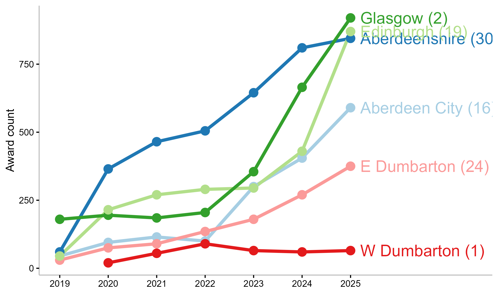
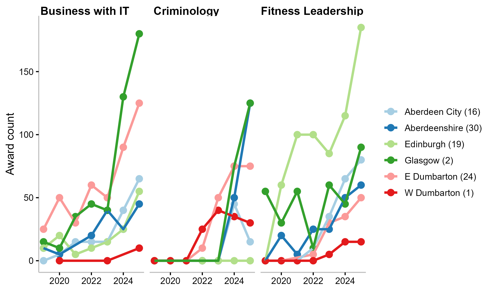

## Context

> __This analysis asks:__  
Does NPA participation at SCQF Level 6 vary systematically with deprivation?
>
> __Deprivation proxy:__ SIMD education deprivation rank  
>
> __Time period:__ 2019-2025

| Education authority                          | SIMD Rank |
|----------------------------------------------|---:|
| [W Dunbartonshire]{style='color: #E31A1C;'}  | 1  |
| [Glasgow City]{style='color: #B2DF8A;'}      | 2  |
| [Aberdeen City]{style='color: #A6CEE3;'}     | 16 |
| [City of Edinburgh]{style='color: #33A02C;'} | 19 |
| [E Dunbartonshire]{style='color: #FB9A99;'}  | 24 |
| [Aberdeenshire]{style='color: #1F78B4;'}     | 30 |

: __Table 1.__ Six EAs selected as three geographic pairs. shown in order if SIMD rank

:::{.notes}
- Six EAs chosen as geographic pairs
- Each pair shares a regional context but differs on deprivation rank
- Islands and rural Highland authorities excluded due to small populations
- Compare within-region before comparing across Scotland
:::


## Data & Methodology

__Three-step subject selection from 74 NPA subjects at SCQF Level 6__

:::{.incremental}
1. __Comparability filter__ - retained only subjects with non-zero, non-suppressed awards in all 6 EAs in 2025 -> __29 subjects__

2. __Volume threshold__ - dropped subjects with fewer than 100 total awards across the 6 EAs in 2025 -> __9 subjects__

3. __Variation + breadth__ - selected three subjects with total and high IQR, covering distinct thematic areas -> __3 final subjects__
:::

:::{.callout-note appearance="minimal"}
All counts are __raw and unweighted__ by school-age population.
Comparisons are made primarily within each EA's own time trend.
:::

:::{.notes}
- Sports Development was passed over in favour of Criminology for breadth
:::


## NPA Subject Selection

:::{.notes}
- IQR was the chosen to give a rough idea of spread
- But N is only 6!
- Subject was considered for one breadth:
    - digital/business subject
    - one social science
    - one health and active living
:::

__Table 2.__ Three subject selected for regional comparison based on volume, variability, and breadth of topic

```{=html}

```


## Finding 1: Overall Participation

:::{.notes}
- __Key points__
- West Dunbartonshire flatlines throughout
    - 65 awards in 2025 vs 375 for East Dunbartonshire
- Glasgow jumps to the top despite being rank 2
- Aberdeenshire consistently strong
- Edinburgh growth in middle

- __Take-home__
- Deprivation is not only factor
- but West Dunbartonshire is a clear and persistent outlier
:::




## Finding 1: Take-away

:::{.columns}
:::{.column width=35%}
<!-- col 1 content -->


:::
:::{.column width=65%}
<!-- col 2 content -->

:::{.callout-tip icon='false'}
### Consistent with deprivation gradient

- __W Dunbartonshire (rank 1)__ flatlines - 65 awards in 2025
- __E Dunbartonshire (rank 24)__ reaches 375 - roughly 6× higher
:::

:::{.callout-caution icon='false'}
### Complicating the narrative
- __Glasgow (rank 2)__ shows the _strongest_ growth of any EA
- __Aberdeenshire (rank 30)__ consistently high throughout
- __Aberdeen City (rank 16)__ outperforms Aberdeenshire in some years
:::

:::{.callout-important appearance="minimal"}
- __Deprivation rank alone does not predict NPA participation__
- but West Dunbartonshire is a clear and persistent equity concern
:::

:::
:::


## Finding 2: Subject-Level Patterns

:::{.notes}
- __Business with IT__
    - Glasgow's jump from 15 to 180.
    - West Dunbartonshire near-zero throughout
    
- __Criminology__
    - Edinburgh zero across all 7 years
    - West Dunbartonshire modest but consistent from 2022 - actually a relative strength for WDumby

- __Exercise & Fitness Leadership__
    - Edinburgh dominates at 185
    - West Dunbartonshire at bottom again
:::




## Finding 2: Three Stories 

:::{.notes}
Summary slide after the chart. 30-45 seconds. Let the contrast between Edinburgh's complete Criminology absence and its Exercise & Fitness dominance land - it shows that the picture isn't simply about affluence or deprivation, it's about curriculum decisions at centre level too.
:::

:::{.columns}
:::{.column width=60%}
<!-- col 1 content -->

:::{.callout-tip icon='false'}
### Business with IT

Glasgow: 15 -> 180 (12 fold increase)
West Dunbartonshire: near-zero throughout  

_The fastest-growing subject has the largest equity gap_
:::

:::{.callout-tip icon='false'}
### Criminology

Edinburgh: __zero across all 7 years__  
Aberdeenshire & Glasgow lead at 125  
W Dunbartonshire: modest but present from 2022  

_Subject access, not just deprivation, shapes the picture_
:::

:::{.callout-tip icon='false'}
### Exercise & Fitness Leadership

Edinburgh dominates at 185  
Glasgow (90), Aberdeen City (80)  
W Dunbartonshire: max 15  

_Edinburgh's strength here contrasts with its weakness in Criminology_
:::
:::
:::{.column width=40%}
<!-- col 2 content -->


:::
:::


## Implications & Questions

:::{.notes}
Surfaces questions for policymakers
:::

:::{.fragment}
:::{.callout-tip icon='false' collapse=true}
### West Dunbartonshire as a structural concern

- consistent flatline across all subjects and all years suggests a barrier beyond curriculum choice: centre capacity, staffing, awareness?
:::
:::

:::{.fragment}
:::{.callout-tip icon='false' collapse=true}
### Glasgow as a case-study?

- strong growth despite high deprivation.
- What drove the Business with IT surge?
- Could it inform support for other high-deprivation authorities?
:::
:::

:::{.fragment}
:::{.callout-tip icon='false' collapse=true}
### Edinburgh's Criminology gap

- zero participation in a growing subject for 7 years.
- Deliberate curriculum choice, delivery constraint, or data anomaly?
:::
:::

:::{.fragment}
:::{.callout-tip icon='false' collapse=true}
### The 2022 inflection

- sharp growth across multiple subjects and EAs from 2022.
Post-pandemic recovery
- But unevenly distributed.
- The rebound has not reached all learners equally.
:::
:::


## Future Analysis

:::{.callout-tip icon='false' collapse=true}
### To strengthen the equity argument

- Normalise by school-age population or chohort size
- Link to centre-level data - are NPAs _offered_ but not completing, or not offered at all?
- Extend to other SCQF levels - do patterns hold beyond Level 6?
:::


## Summary

:::{.div style='padding: 10px; background-color: navy; color: white; border-radius: 10px;'}
:::{.columns}
:::{.column width=50%}
__What the data shows:__  
West Dunbartonshire show a clear and persistent __equity concern__  
Consistent across subjects and years.
:::
:::{.column width=50%}
__What it raises:__  
Understanding the drivers behind both the successes _and_ the gaps is essential if qualifications are to be relevant, inclusive and fit for all learners.
:::
:::
:::

:::{.div style='background-color: gold; color: navy; border-radius: 10px;'}
> NPA participation at SCQF Level 6 has grown substantially since 2019 - but that growth is unevenly distributed in ways that correlate only __partially__ with deprivation.
:::

:::{.fragment}
_Thank you - happy to take questions._
:::

:::{.notes}
Final line steal fwo QS's own stated mission from candidate guide.
:::


## Tools used

:::{.callout-tip icon='false' collapse=true}
### This analysis was built using

- R (tidyverse, ggplot2, gt)
- Quarto for reproducible reporting
- SIMD education deprivation rankings
- Qualifications Scotland published statistics

:::
